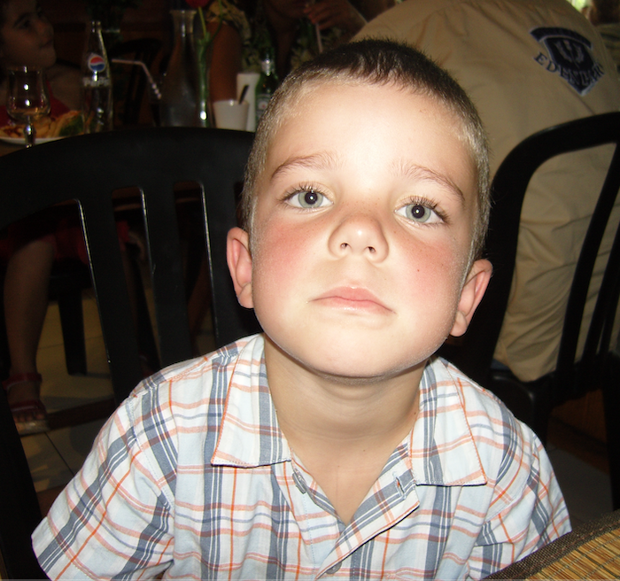
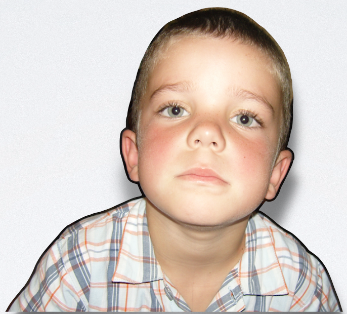

# Mirrormorphose

Mirrormorphose is a experimental project working with Researcher Xiao Xiao where the goal is to make a mirror in which if you stare into your reflection eyes you turn into yourself as a child but the moment you look away, it fades away. Still ongoing.


## Features

- Picamera compatible
- Raspberry pi compatible
- two way mirror
- monitor
- Opencv.js module
- Web requests for later on art installation to calibrate everything and make sure every step of the process is working
- background removal with rembg
- Runway API module for video generation
- Test tag for testing 

## Process

### Phase 1: explorations

**Stable Video Diffusion**: tried lcm, sdxl, streamdiffusion doesn't work in the current context.

**Deep fakes**: tried LivePortrait, First-Order-Model doesn't work in the current context.

**Text-to-video**: tried Segmind and Runway API and got better results with Runway.

### Phase 2: api module


Takes an image as input, makes the request to the API server and displays the video on loop.


When you put the tag to ```true``` it plays the test video for any video processing and testing.

### Phase 3: opencv module


When you go to ```\stream.mjpg\``` you can see what the camera sees so that we can check if the mirroir is at the right distance of the participant.


With ```\pages\opencv_out``` you can see if the detection works well, to tune it a bit we added ratio calculations and a sort of moving average.

### Results

So first you apload a picture of yourself younger on the website.



Then it automatically removes the background and sends it to the API server. You can check if everything works well by going to ```\get_child_img\```.



And finally here's the result !


### Fails

It works really well on certain persons but for some reason it doesn't work at all on me.

Here is the input:


And this is what I got:


